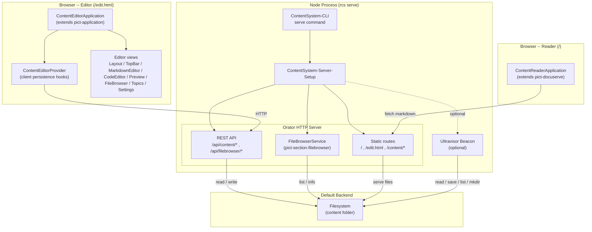
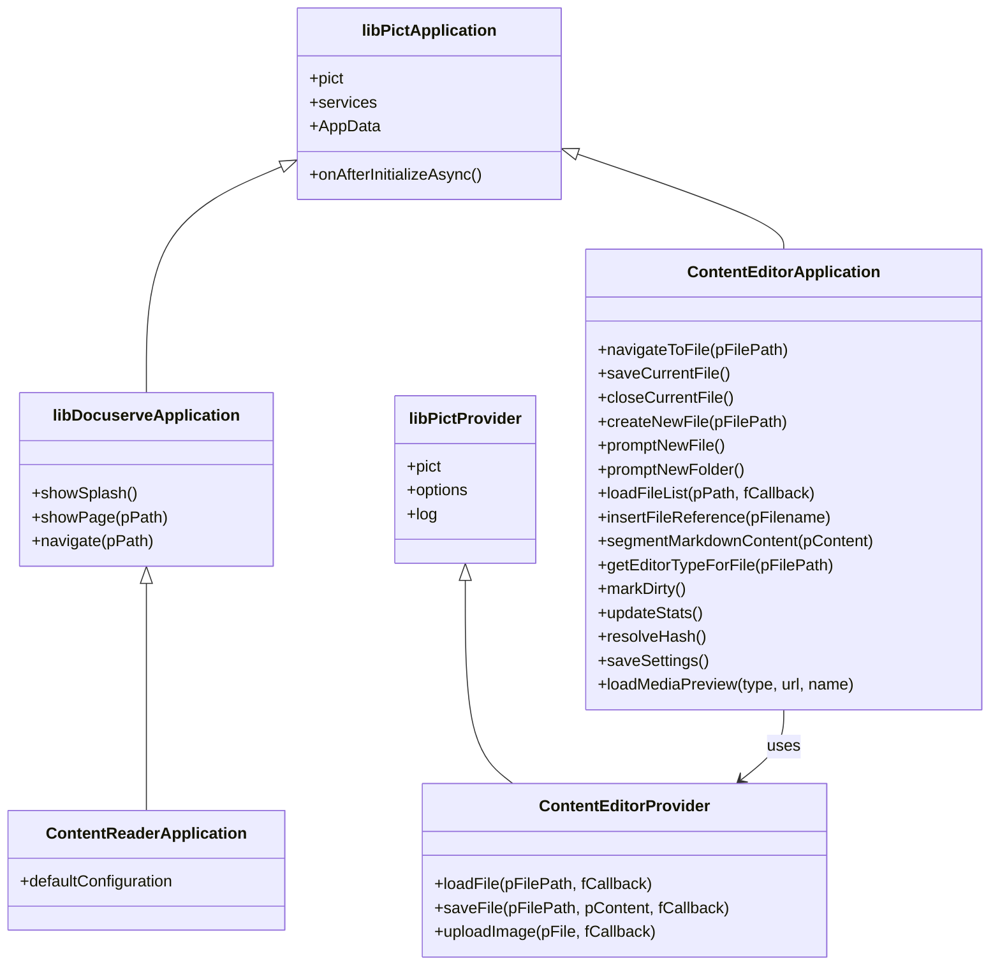
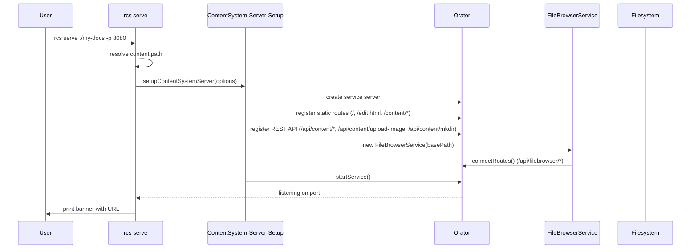
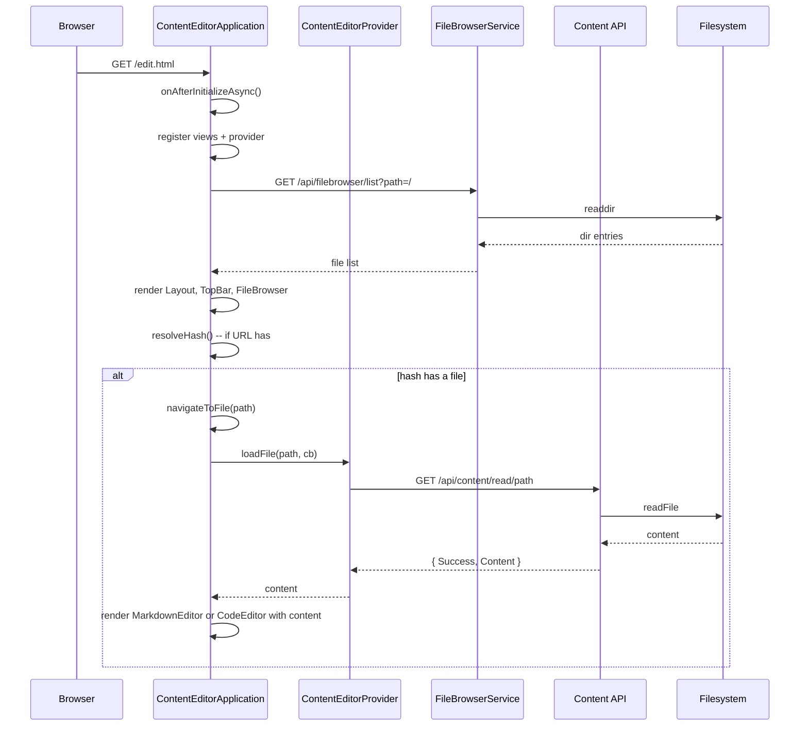
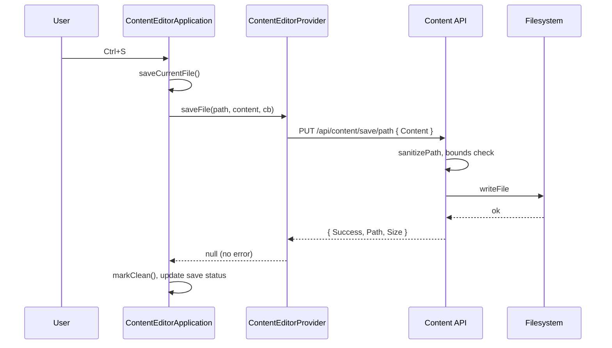
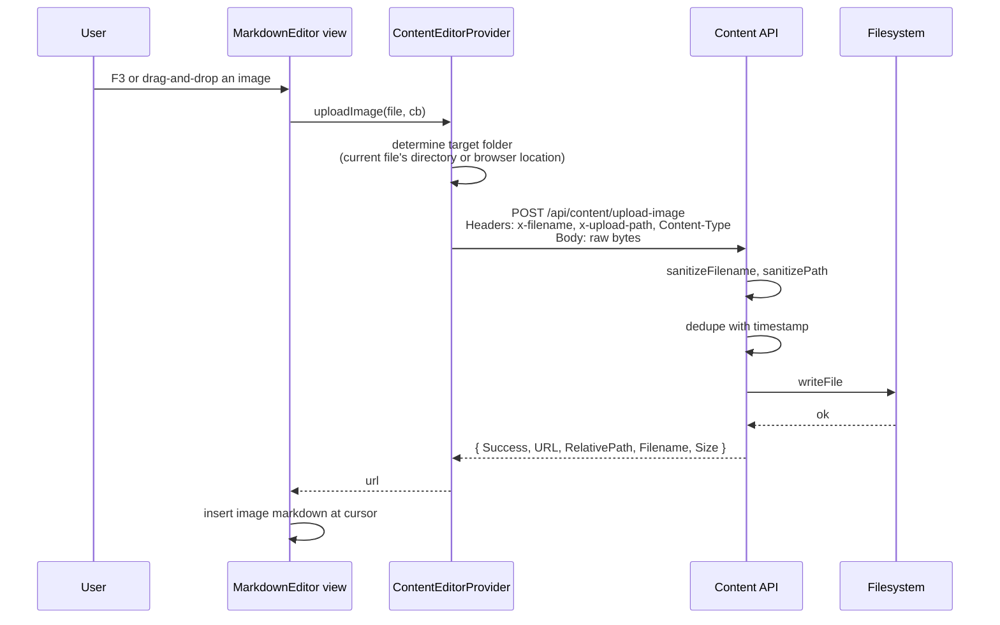

# Architecture

The Retold Content System is a Node CLI that starts a small Orator HTTP server serving two Pict applications (reader and editor) from the same origin, plus a tiny REST API for content operations. Every layer is designed to be replaced: the filesystem backend is the default but not the only option.

## Process Layout



Any of the dashed or solid arrows in the "Default Backend" column can be redirected at a different store. The [Persistence Hooks](persistence-hooks.md) guide walks through each option.

## Class Hierarchy



## Server Startup



## Editor Load Flow



## Save Flow



## Image Upload Flow



## REST Endpoints

The Orator server exposes a small, overridable set of routes:

### Static

| Method | Path | Purpose |
|---|---|---|
| GET | `/` | Reader (`index.html`) |
| GET | `/edit.html` | Editor (`edit.html`) |
| GET | `/preview.html` | Standalone preview |
| GET | `/content/*` | Static access to the content folder (markdown, images, binaries) |

### Content API

| Method | Path | Purpose |
|---|---|---|
| GET | `/api/content/read/:filepath` | Return `{ Success, Content }` for a file |
| PUT | `/api/content/save/:filepath` | Save `{ Content }` to a file |
| POST | `/api/content/upload-image` | Upload an image; headers `x-filename` and `x-upload-path`; body is the raw bytes |
| POST | `/api/content/mkdir` | Create a folder from `{ Path }` |

### File Browser API (from `pict-section-filebrowser`)

| Method | Path | Purpose |
|---|---|---|
| GET | `/api/filebrowser/list` | List the contents of a folder |
| GET | `/api/filebrowser/info` | Return metadata for a single entry |
| PUT | `/api/filebrowser/settings` | Update runtime settings (e.g. `IncludeHiddenFiles`) |

Each of these routes is a plain Orator route defined in `ContentSystem-Server-Setup.js`. You can replace any of them before `startService()` to point at a different backend. See [Persistence Hooks](persistence-hooks.md) for the full recipe.

## File Layout

```
retold-content-system/
├── README.md
├── package.json
├── source/
│   ├── Pict-ContentSystem-Bundle.js               # browser bundle entry
│   ├── Pict-Application-ContentReader.js          # reader application
│   ├── Pict-Application-ContentReader-Configuration.json
│   ├── Pict-Application-ContentEditor.js          # editor application
│   ├── Pict-Application-ContentEditor-Configuration.json
│   ├── cli/
│   │   ├── ContentSystem-CLI-Run.js               # bin entry
│   │   ├── ContentSystem-CLI-Program.js           # command definitions
│   │   ├── ContentSystem-Server-Setup.js          # Orator wiring
│   │   └── commands/
│   │       └── ContentSystem-Command-Serve.js     # serve command
│   ├── providers/
│   │   └── Pict-Provider-ContentEditor.js         # client persistence hooks
│   └── views/
│       ├── PictView-Editor-Layout.js
│       ├── PictView-Editor-TopBar.js
│       ├── PictView-Editor-MarkdownEditor.js
│       ├── PictView-Editor-CodeEditor.js
│       ├── PictView-Editor-MarkdownReference.js
│       ├── PictView-Editor-SettingsPanel.js
│       └── PictView-Editor-Topics.js
├── html/
│   ├── index.html                                 # reader entry
│   ├── edit.html                                  # editor entry
│   └── preview.html
├── web-application/                               # built bundles + CSS
├── content/                                       # example content folder
└── docs/
	├── README.md, _cover.md, _sidebar.md, _topbar.md
	├── quickstart.md
	├── architecture.md
	├── configuration.md
	├── api-reference.md
	├── code-snippets.md
	├── persistence-hooks.md
	└── cli-reference.md
```

## Client State

The editor application keeps its runtime state under `pict.AppData.ContentEditor`:

| Key | Type | Purpose |
|---|---|---|
| `CurrentFile` | `string` | Relative path of the file currently open in the editor |
| `ActiveEditor` | `'markdown' \| 'code'` | Which editor variant is mounted |
| `IsDirty` | `boolean` | Unsaved-changes flag |
| `IsSaving` / `IsLoading` | `boolean` | Async operation flags for UI indicators |
| `Files` | `array` | File list from the browser sidebar |
| `Document.Segments` | `array` | Markdown content broken into one or more segments |
| `CodeContent` | `string` | Raw content buffer for the code editor |
| `SaveStatus` / `SaveStatusClass` | `string` | Save banner text + CSS modifier |
| `AutoSegmentMarkdown` / `AutoSegmentDepth` | mixed | Segmentation settings |
| `ContentPreviewMode` | `'off' \| 'preview' \| 'split'` | Preview pane visibility |
| `MarkdownWordWrap` / `CodeWordWrap` | `boolean` | Editor line-wrap flags |
| `SidebarCollapsed` / `SidebarWidth` | mixed | File browser sidebar state |
| `AutoPreviewImages` / `AutoPreviewVideo` / `AutoPreviewAudio` | `boolean` | Auto-load binary previews |
| `ShowHiddenFiles` | `boolean` | Show dotfiles in the file browser |
| `TopicsFilePath` | `string` | Path to the `.pict_documentation_topics.json` manifest |

The user-facing subset of these is persisted in `localStorage` so settings survive page reloads.

## Path Safety

All server routes use two sanitization helpers:

- `sanitizePath(pPath)` -- rejects absolute paths, strips `..` segments, strips `<>"|?*`, validates with `realpathSync` that the resolved path stays within the content folder
- `sanitizeFilename(pName)` -- strips path separators and unsafe characters from uploaded filenames, and dedupes against existing files with a `_YYYYMMDDHHMMSS` suffix

Any custom persistence backend that exposes a filesystem interface should apply the same rules.
