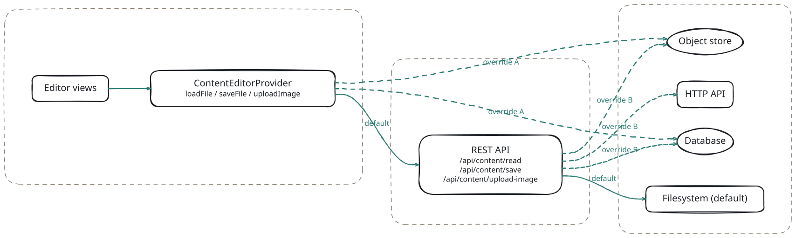

# Persistence Hooks

The Retold Content System is shipped with a filesystem-backed default, but every place it touches storage is a named, overridable boundary. This guide covers every extension point in detail and walks through concrete examples for database, S3, HTTP-backed, and in-memory backends -- for both **markdown content** and **images**.

## The Three Boundaries

There are exactly three operations to replace:

1. **Load markdown** -- read a file's content
2. **Save markdown** -- write a file's content
3. **Upload an image** -- store an image and return a public URL

Each one lives at two places: a method on `ContentEditorProvider` (the client-side provider the editor views call) and a REST endpoint on the Orator server that the default provider hits. You can override at either layer -- or both -- depending on how much of the system you own.

<!-- bespoke diagram: edit diagrams/the-three-boundaries.mmd or .hints.json, then: npx pict-renderer-graph build modules/apps/retold-content-system/docs -->


There are two replacement strategies:

- **Override A (client-side provider):** keep the server untouched; subclass `ContentEditorProvider` and talk to your backend directly from the browser. Useful when the content backend is public-facing (a REST API, Firebase, Supabase, etc.) and you do not want to run the bundled Orator server.
- **Override B (server-side endpoints):** keep the default client provider; replace the REST endpoints in `ContentSystem-Server-Setup.js` with your own handlers that read / write to your backend. Useful when the backend needs privileged access (a database, an S3 bucket with IAM credentials, a private HTTP API) and you want the browser to only talk to your Node server.

Most real deployments use override B (server-side). Override A is simpler and is a good fit for fully-public or auth-delegated backends.

## Strategy 1: Override the Client Provider

### Step 1 -- Subclass `ContentEditorProvider`

```javascript
const libPictProvider = require('pict-provider');

class MyCustomContentProvider extends libPictProvider
{
	constructor(pFable, pOptions, pServiceHash)
	{
		super(pFable, pOptions, pServiceHash);
	}

	loadFile(pFilePath, fCallback)
	{
		// ... call your backend, then invoke:
		// fCallback(null, contentString)
		// or fCallback('error message', '')
	}

	saveFile(pFilePath, pContent, fCallback)
	{
		// ... persist the content, then invoke:
		// fCallback(null)
		// or fCallback('error message')
	}

	uploadImage(pFile, fCallback)
	{
		// ... store the image, then invoke:
		// fCallback(null, 'https://cdn.example.com/path/to/image.png')
		// or fCallback('error message')
	}
}

module.exports = MyCustomContentProvider;
module.exports.default_configuration =
{
	"ProviderIdentifier":    "ContentEditor-Provider",
	"AutoInitialize":        true,
	"AutoInitializeOrdinal": 0
};
```

### Step 2 -- Register It

Register your subclass under the name `ContentEditor-Provider` **before** the editor application registers the default. The cleanest place is inside a subclass of `ContentEditorApplication`:

```javascript
const libContentEditor      = require('retold-content-system').ContentEditorApplication;
const MyCustomContentProvider = require('./MyCustomContentProvider');

class MyContentEditorApplication extends libContentEditor
{
	constructor(pFable, pOptions, pServiceHash)
	{
		super(pFable, pOptions, pServiceHash);

		// Override the default provider
		this.pict.addProvider(
			'ContentEditor-Provider',
			MyCustomContentProvider.default_configuration,
			MyCustomContentProvider);
	}
}

module.exports = MyContentEditorApplication;
```

Mount the subclass in your HTML instead of the default `PictContentEditor`:

```html
<script>
	Pict.safeOnDocumentReady(() => Pict.safeLoadPictApplication(MyContentEditorApplication, 2));
</script>
```

### Step 3 -- Run Without the Bundled Server

If you are talking to your backend directly from the browser, you no longer need `rcs serve`. Host the editor HTML / bundle on any static file server (or import it into your own Pict application).

## Strategy 2: Override the Server Endpoints

This is the more common approach. You keep the default `ContentEditorProvider` as-is, and replace the REST endpoints that back it with custom Orator handlers.

### Step 1 -- Write a Server Wrapper

Instead of calling `rcs serve` directly, write a small Node script that uses `ContentSystem-Server-Setup.js` but installs your own handlers before `startService()`.

```javascript
const libFable   = require('fable');
const libOrator  = require('orator');
const setup      = require('retold-content-system/source/cli/ContentSystem-Server-Setup');

const _Fable  = new libFable({ Product: 'MyContentServer', LogStreams: [] });
const _Orator = new libOrator({
	Product:            'MyContentServer',
	APIServerPort:       8080,
	APIServerAddress:    '0.0.0.0'
}, _Fable);

// Set up the content system's standard routes
setup.setupContentSystemServer(_Orator, {
	ContentPath: '/var/data/content',  // still used as a fallback / for /content/*
	DistPath:    require.resolve('retold-content-system/web-application')
});

const server = _Orator.webServer;

// Override the read endpoint
server.get('/api/content/read/*', async (pRequest, pResponse, fNext) =>
{
	const tmpPath = pRequest.params['*'];
	try
	{
		const tmpContent = await myDb.query('SELECT content FROM files WHERE path = $1', [tmpPath]);
		pResponse.send({ Success: true, Content: tmpContent?.content ?? '' });
	}
	catch (pError)
	{
		pResponse.send({ Success: false, Error: pError.message });
	}
});

// Override the save endpoint
server.put('/api/content/save/*', async (pRequest, pResponse, fNext) =>
{
	const tmpPath    = pRequest.params['*'];
	const tmpContent = pRequest.body?.Content ?? '';
	try
	{
		await myDb.query(
			'INSERT INTO files (path, content) VALUES ($1, $2) ON CONFLICT (path) DO UPDATE SET content = $2',
			[tmpPath, tmpContent]);
		pResponse.send({ Success: true, Path: tmpPath, Size: tmpContent.length });
	}
	catch (pError)
	{
		pResponse.send({ Success: false, Error: pError.message });
	}
});

// Override the image upload endpoint
server.post('/api/content/upload-image', async (pRequest, pResponse, fNext) =>
{
	const tmpFilename   = pRequest.headers['x-filename'];
	const tmpUploadPath = pRequest.headers['x-upload-path'] || '';
	const tmpBody       = pRequest.body;  // raw buffer

	try
	{
		const tmpUrl = await myObjectStore.put(tmpUploadPath + '/' + tmpFilename, tmpBody);
		pResponse.send({
			Success:      true,
			URL:          tmpUrl,
			RelativePath: tmpUploadPath + '/' + tmpFilename,
			Filename:     tmpFilename,
			Size:         tmpBody.length
		});
	}
	catch (pError)
	{
		pResponse.send({ Success: false, Error: pError.message });
	}
});

_Orator.startWebServer(() => console.log('Custom content server on :8080'));
```

The key insight is that these routes use the same request / response shapes as the defaults, so the client provider continues to work unchanged.

### Step 2 -- Apply Path Sanitization

If your backend stores content by path, apply the same sanitization the default handlers do:

```javascript
const libPath = require('path');

function sanitizePath(pPath)
{
	if (!pPath || typeof pPath !== 'string') return '';
	if (libPath.isAbsolute(pPath)) return '';             // no absolute paths
	const tmpNormalized = libPath.normalize(pPath);
	if (tmpNormalized.startsWith('..')) return '';        // no escapes
	return tmpNormalized.replace(/[<>"|?*]/g, '');        // strip dangerous chars
}
```

## Recipe: Markdown in Postgres

```javascript
const { Pool } = require('pg');
const _Pool    = new Pool({ connectionString: process.env.DATABASE_URL });

server.get('/api/content/read/*', async (pRequest, pResponse) =>
{
	const tmpPath = sanitizePath(pRequest.params['*']);
	const tmpResult = await _Pool.query(
		'SELECT content FROM content_files WHERE path = $1',
		[tmpPath]);
	if (tmpResult.rows.length === 0)
	{
		pResponse.send(404, { Success: false, Error: 'Not found' });
		return;
	}
	pResponse.send({ Success: true, Content: tmpResult.rows[0].content });
});

server.put('/api/content/save/*', async (pRequest, pResponse) =>
{
	const tmpPath    = sanitizePath(pRequest.params['*']);
	const tmpContent = pRequest.body?.Content ?? '';
	await _Pool.query(
		`INSERT INTO content_files (path, content, updated_at)
		 VALUES ($1, $2, NOW())
		 ON CONFLICT (path) DO UPDATE
		 SET content = EXCLUDED.content, updated_at = NOW()`,
		[tmpPath, tmpContent]);
	pResponse.send({ Success: true, Path: tmpPath, Size: tmpContent.length });
});
```

Schema:

```sql
CREATE TABLE content_files (
	path         TEXT PRIMARY KEY,
	content      TEXT NOT NULL,
	created_at   TIMESTAMPTZ NOT NULL DEFAULT NOW(),
	updated_at   TIMESTAMPTZ NOT NULL DEFAULT NOW()
);

CREATE INDEX ON content_files (updated_at DESC);
```

## Recipe: Markdown in MongoDB

```javascript
const { MongoClient } = require('mongodb');
const _Client = new MongoClient(process.env.MONGO_URL);
const _Files  = _Client.db('docs').collection('content_files');

server.get('/api/content/read/*', async (pRequest, pResponse) =>
{
	const tmpPath = sanitizePath(pRequest.params['*']);
	const tmpDoc  = await _Files.findOne({ path: tmpPath });
	if (!tmpDoc)
	{
		pResponse.send(404, { Success: false, Error: 'Not found' });
		return;
	}
	pResponse.send({ Success: true, Content: tmpDoc.content });
});

server.put('/api/content/save/*', async (pRequest, pResponse) =>
{
	const tmpPath    = sanitizePath(pRequest.params['*']);
	const tmpContent = pRequest.body?.Content ?? '';
	await _Files.updateOne(
		{ path: tmpPath },
		{ $set: { content: tmpContent, updatedAt: new Date() } },
		{ upsert: true });
	pResponse.send({ Success: true, Path: tmpPath, Size: tmpContent.length });
});
```

## Recipe: Markdown in a Git Repository

Use `simple-git` or `nodegit` to commit changes on save:

```javascript
const simpleGit = require('simple-git');
const libFs     = require('fs');
const libPath   = require('path');

const REPO_PATH = '/var/data/docs-repo';
const _Git = simpleGit(REPO_PATH);

server.get('/api/content/read/*', (pRequest, pResponse) =>
{
	const tmpPath     = sanitizePath(pRequest.params['*']);
	const tmpFullPath = libPath.join(REPO_PATH, tmpPath);
	const tmpContent  = libFs.readFileSync(tmpFullPath, 'utf8');
	pResponse.send({ Success: true, Content: tmpContent });
});

server.put('/api/content/save/*', async (pRequest, pResponse) =>
{
	const tmpPath     = sanitizePath(pRequest.params['*']);
	const tmpFullPath = libPath.join(REPO_PATH, tmpPath);
	const tmpContent  = pRequest.body?.Content ?? '';

	libFs.writeFileSync(tmpFullPath, tmpContent, 'utf8');

	await _Git.add(tmpPath);
	await _Git.commit(`edit: ${ tmpPath }`, undefined, {
		'--author': '"Content Editor <editor@example.com>"'
	});
	await _Git.push();

	pResponse.send({ Success: true, Path: tmpPath, Size: tmpContent.length });
});
```

Every save becomes a commit. Combine with an upstream Git server (GitHub, GitLab, Gitea) to get revision history, pull requests, and conflict resolution for free.

## Recipe: Images in S3

```javascript
const { S3Client, PutObjectCommand } = require('@aws-sdk/client-s3');
const _S3 = new S3Client({ region: 'us-east-1' });

server.post('/api/content/upload-image', async (pRequest, pResponse) =>
{
	const tmpFilename   = sanitizeFilename(pRequest.headers['x-filename']);
	const tmpUploadPath = sanitizePath(pRequest.headers['x-upload-path'] || '');
	const tmpKey        = (tmpUploadPath ? tmpUploadPath + '/' : '') + timestamp(tmpFilename);
	const tmpBody       = pRequest.body;

	await _S3.send(new PutObjectCommand({
		Bucket:      process.env.IMAGE_BUCKET,
		Key:         tmpKey,
		Body:        tmpBody,
		ContentType: pRequest.headers['content-type'] || 'application/octet-stream',
		ACL:         'public-read'
	}));

	const tmpUrl = `https://${ process.env.IMAGE_BUCKET }.s3.amazonaws.com/${ tmpKey }`;

	pResponse.send({
		Success:      true,
		URL:          tmpUrl,
		RelativePath: tmpKey,
		Filename:     tmpFilename,
		Size:         tmpBody.length
	});
});

function timestamp(pFilename)
{
	const tmpExt      = libPath.extname(pFilename);
	const tmpBase     = libPath.basename(pFilename, tmpExt);
	const tmpStamp    = new Date().toISOString().replace(/[-:.]/g, '').slice(0, 14);
	return `${ tmpBase }_${ tmpStamp }${ tmpExt }`;
}
```

The returned URL is the public S3 URL. The editor inserts it directly as `` and the reader loads the image from S3.

## Recipe: Images in a Database (BLOB Storage)

Not recommended for large libraries, but sometimes required for compliance:

```javascript
server.post('/api/content/upload-image', async (pRequest, pResponse) =>
{
	const tmpFilename = sanitizeFilename(pRequest.headers['x-filename']);
	const tmpBody     = pRequest.body;
	const tmpMime     = pRequest.headers['content-type'];

	const tmpResult = await _Pool.query(
		`INSERT INTO images (filename, mime_type, data) VALUES ($1, $2, $3) RETURNING id`,
		[tmpFilename, tmpMime, tmpBody]);

	const tmpId  = tmpResult.rows[0].id;
	const tmpUrl = `/api/images/${ tmpId }`;

	pResponse.send({
		Success:      true,
		URL:          tmpUrl,
		RelativePath: tmpUrl,
		Filename:     tmpFilename,
		Size:         tmpBody.length
	});
});

// Companion route to serve images back out
server.get('/api/images/:id', async (pRequest, pResponse) =>
{
	const tmpResult = await _Pool.query(
		`SELECT mime_type, data FROM images WHERE id = $1`,
		[pRequest.params.id]);
	if (tmpResult.rows.length === 0) return pResponse.send(404);
	pResponse.setHeader('Content-Type', tmpResult.rows[0].mime_type);
	pResponse.send(tmpResult.rows[0].data);
});
```

## Recipe: Images via a CDN Upload API

If your CDN offers a direct-upload API (Cloudinary, imgix, Bunny, etc.):

```javascript
server.post('/api/content/upload-image', async (pRequest, pResponse) =>
{
	const tmpFilename = sanitizeFilename(pRequest.headers['x-filename']);
	const tmpBody     = pRequest.body;

	const tmpForm = new FormData();
	tmpForm.append('file', new Blob([tmpBody]), tmpFilename);
	tmpForm.append('upload_preset', process.env.CLOUDINARY_PRESET);

	const tmpResponse = await fetch(
		`https://api.cloudinary.com/v1_1/${ process.env.CLOUDINARY_CLOUD }/image/upload`,
		{ method: 'POST', body: tmpForm });
	const tmpJson = await tmpResponse.json();

	pResponse.send({
		Success:      true,
		URL:          tmpJson.secure_url,
		RelativePath: tmpJson.public_id,
		Filename:     tmpFilename,
		Size:         tmpJson.bytes
	});
});
```

## Recipe: Hybrid -- Markdown in Filesystem, Images in S3

A common real-world setup. Leave the default read/save endpoints in place (filesystem-backed) and override only the image upload:

```javascript
setup.setupContentSystemServer(_Orator, {
	ContentPath: '/var/data/content'
});

// Defaults are already installed; just override the image upload
server.post('/api/content/upload-image', async (pRequest, pResponse) =>
{
	// ... S3 upload code from above
});
```

## Recipe: Client-Side Provider Talking to Firebase

Pure client-side override -- no custom Node server required. Works when the editor is hosted as static files and the backend is a public API with its own auth.

```javascript
const libPictProvider = require('pict-provider');
const { initializeApp }       = require('firebase/app');
const { getFirestore, doc, getDoc, setDoc } = require('firebase/firestore');
const { getStorage, ref, uploadBytes, getDownloadURL } = require('firebase/storage');

const _App = initializeApp({ /* firebase config */ });
const _Db  = getFirestore(_App);
const _Storage = getStorage(_App);

class FirebaseContentProvider extends libPictProvider
{
	loadFile(pFilePath, fCallback)
	{
		getDoc(doc(_Db, 'content', pFilePath))
			.then((snap) =>
			{
				if (!snap.exists()) return fCallback('Not found', '');
				fCallback(null, snap.data().content || '');
			})
			.catch((err) => fCallback(err.message, ''));
	}

	saveFile(pFilePath, pContent, fCallback)
	{
		setDoc(doc(_Db, 'content', pFilePath), { content: pContent, updatedAt: new Date() })
			.then(() => fCallback(null))
			.catch((err) => fCallback(err.message));
	}

	uploadImage(pFile, fCallback)
	{
		const tmpRef = ref(_Storage, `images/${ Date.now() }_${ pFile.name }`);
		uploadBytes(tmpRef, pFile)
			.then((snap) => getDownloadURL(snap.ref))
			.then((url) => fCallback(null, url))
			.catch((err) => fCallback(err.message));
	}
}

module.exports = FirebaseContentProvider;
module.exports.default_configuration =
{
	"ProviderIdentifier":    "ContentEditor-Provider",
	"AutoInitialize":        true,
	"AutoInitializeOrdinal": 0
};
```

## Recipe: In-Memory Provider for Tests

```javascript
class InMemoryContentProvider extends libPictProvider
{
	constructor(pFable, pOptions, pServiceHash)
	{
		super(pFable, pOptions, pServiceHash);
		this.files  = new Map();
		this.images = new Map();
	}

	loadFile(pFilePath, fCallback)
	{
		setTimeout(() =>
		{
			if (!this.files.has(pFilePath)) return fCallback('Not found', '');
			fCallback(null, this.files.get(pFilePath));
		}, 0);
	}

	saveFile(pFilePath, pContent, fCallback)
	{
		setTimeout(() =>
		{
			this.files.set(pFilePath, pContent);
			fCallback(null);
		}, 0);
	}

	uploadImage(pFile, fCallback)
	{
		setTimeout(() =>
		{
			const tmpUrl = `blob:inmem/${ Date.now() }_${ pFile.name }`;
			this.images.set(tmpUrl, pFile);
			fCallback(null, tmpUrl);
		}, 0);
	}
}
```

Useful for integration tests that exercise the editor UI without touching the network.

## Replacing the File Browser Backend

The file list sidebar is powered by `pict-section-filebrowser`'s `FileBrowserService`, which uses the filesystem by default. To replace it:

```javascript
const libPictSectionFilebrowser = require('pict-section-filebrowser');

class MyFileBrowserService extends libPictSectionFilebrowser.FileBrowserService
{
	listFiles(pPath, fCallback)
	{
		// Return an array of { Name, Type: 'file'|'dir', Size, Modified }
	}

	getFileInfo(pPath, fCallback)
	{
		// Return metadata for a single entry
	}
}
```

Instantiate your subclass and call `connectRoutes()` to wire its REST endpoints in place of the default. See the `pict-section-filebrowser` documentation for the full interface.

## Testing a Custom Backend

When you introduce a custom backend, the fastest way to verify it is:

1. Register the subclass / install the custom route
2. `rcs serve` (or your custom server) the content folder
3. Open `/edit.html` and open a file -- your backend's read should fire
4. Edit and press `Ctrl+S` -- your backend's save should fire
5. Press F3 and upload an image -- your backend's upload should fire and the editor should insert the returned URL at the cursor

Watch the browser devtools Network tab: every HTTP call made by the provider is visible there, and every response must include the `{ Success: true, ... }` shape documented in [API Reference](api-reference.md).

## Summary of Hook Points

| Hook | Layer | Default | Override By |
|---|---|---|---|
| Load markdown | Client | `GET /api/content/read/<path>` | Subclass `ContentEditorProvider.loadFile` |
| Load markdown | Server | `libFs.readFileSync(contentPath)` | Replace the `GET /api/content/read/*` Orator route |
| Save markdown | Client | `PUT /api/content/save/<path>` | Subclass `ContentEditorProvider.saveFile` |
| Save markdown | Server | `libFs.writeFileSync(contentPath)` | Replace the `PUT /api/content/save/*` Orator route |
| Upload image | Client | `POST /api/content/upload-image` | Subclass `ContentEditorProvider.uploadImage` |
| Upload image | Server | `libFs.writeFileSync(timestampedPath)` | Replace the `POST /api/content/upload-image` Orator route |
| List files | Server | `FileBrowserService` on filesystem | Subclass `FileBrowserService` and call `connectRoutes()` |
| Create folder | Server | `libFs.mkdirSync` | Replace the `POST /api/content/mkdir` Orator route |
| Static file access | Server | Orator static handler at `/content/*` | Replace the `/content/*` route |

Every hook takes the same request / response shape as the default, so overriding one does not require changes in any other layer.
