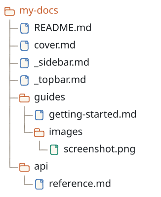

# Quick Start

This guide walks through installing the content system, serving a folder, editing a file, and customizing a few common options.

## 1. Install

For one-off use, run it through `npx`:

```bash
npx retold-content-system serve ./my-docs
```

For frequent use, install globally:

```bash
npm install -g retold-content-system
rcs serve ./my-docs
```

Or install it as a project dependency:

```bash
npm install retold-content-system
npx rcs serve ./docs
```

The CLI exposes two equivalent entry points: `retold-content-system` and the shorter `rcs`.

## 2. Prepare a Content Folder

A content folder is just any directory with markdown files. A typical layout:

<!-- bespoke diagram: edit diagrams/2-prepare-a-content-folder.mmd or .hints.json, then: npx pict-renderer-graph build modules/apps/retold-content-system/docs -->


Only `README.md` is needed to get started -- everything else is optional. The `cover.md`, `_sidebar.md`, and `_topbar.md` files are interpreted by the reader (via `pict-docuserve`) to build the splash, navigation, and top bar.

## 3. Start the Server

```bash
rcs serve ./my-docs
```

Output:

```
==========================================================
  Retold Content System running on http://localhost:7234
==========================================================
  Content: /Users/steven/my-docs
==========================================================
```

The port is random by default (7000-7999). Pick a specific port with `-p`:

```bash
rcs serve ./my-docs -p 8080
```

Tip: if you run `rcs serve` from a directory that has a `./content/` subfolder, the CLI uses that folder automatically. This matches the `docs/` or `content/` layout most repos use.

## 4. Open the Reader

Navigate to `http://localhost:<port>/`. You get the documentation reader, which:

- Reads `cover.md` for the splash screen
- Reads `_sidebar.md` for the left navigation
- Reads `_topbar.md` for the top bar
- Renders any other markdown file via hash routes (`#/guides/getting-started`)
- Supports Mermaid diagrams and KaTeX equations

This is the same experience as `pict-docuserve` with your content folder already mounted.

## 5. Open the Editor

Navigate to `http://localhost:<port>/edit.html`. You get a full authoring environment:

- **File browser sidebar** on the left (tree or list view, with breadcrumbs and hidden-file toggle)
- **Top bar** with the current file name, save status, character / word / line counts, save button, and close button
- **Editor area** -- CodeMirror for markdown, CodeJar for code files, or a preview card for binary files
- **Reference panel** (toggle with F1) that shows the rendered markdown next to the editor
- **Settings panel** (toggle with F4) for word wrap, preview mode, segmentation, and more

Click a file in the sidebar to open it. Edit, save with `Ctrl+S`, and watch the reader reflect the changes immediately.

## 6. Upload an Image

Inside the markdown editor, press `F3` or click the image button in the toolbar. Pick an image file; the server writes it to the folder that holds the current file being edited and inserts a `!\[alt](relative/path)` reference at the cursor.

By default images are stored directly on disk next to the file. To store them in cloud storage instead, see [Persistence Hooks](persistence-hooks.md).

## 7. Customize Settings

Open the settings panel (F4 or the settings tab in the sidebar) to toggle:

| Setting | Effect |
|---|---|
| Auto Segment Markdown | Split each markdown file into segments by heading depth |
| Segmentation Depth | Which heading level (1-6) to split on |
| Content Preview Mode | Off / Preview only / Split |
| Markdown Editing Controls | Show line numbers and right-side editing tools |
| Markdown Word Wrap | Enable CodeMirror line wrapping |
| Code Word Wrap | Enable word wrap in the code editor |
| Show Hidden Files | Show dotfiles in the file browser |
| Auto Preview Images / Video / Audio | Auto-load binary previews when navigating to them |
| Topics File Path | Path to the `.pict_documentation_topics.json` manifest |

Settings persist in browser `localStorage` per origin.

## 8. Create a Topics Manifest (Optional)

Drop a `.pict_documentation_topics.json` file into your content folder:

```json
{
	"Topics":
	[
		{
			"Code":      "auth-intro",
			"Title":     "Authentication Introduction",
			"FilePath":  "guides/authentication.md",
			"StartLine": 5,
			"EndLine":   20
		},
		{
			"Code":      "auth-oauth",
			"Title":     "OAuth Flow",
			"FilePath":  "guides/authentication.md",
			"StartLine": 22,
			"EndLine":   45
		}
	]
}
```

The editor's Topics tab shows each topic with a clickable code that jumps to the specified line range. This is how `retold` apps link API reference sections to documentation excerpts.

## 9. Serve Static Files

Every file in the content folder is also served under `/content/*` as a plain static file. Markdown files are returned as text, images / video / audio / documents are returned with the correct content type, and any path outside the content folder is rejected. Use this when you want to link directly to an asset from outside the reader or editor.

## 10. Ultravisor Beacon Mode (Optional)

For deployments where the content system should respond to remote workflow requests instead of local HTTP traffic, run it as an Ultravisor beacon:

```bash
rcs serve ./docs \
	-b http://localhost:54321 \
	--beacon-name content-edge-1 \
	--beacon-password hunter2
```

This registers the following capabilities with the Ultravisor server:

- `ReadFile` -- Returns the content of a file
- `SaveFile` -- Writes content to a file
- `ListFiles` -- Lists the contents of a folder
- `CreateFolder` -- Creates a folder

Ultravisor operations can then dispatch these capabilities as workflow steps. See the [CLI Reference](cli-reference.md) for all beacon options.

## 11. Next Steps

- [Persistence Hooks](persistence-hooks.md) -- **the most important guide** if you want to replace the default filesystem storage with a database, object store, or HTTP backend
- [Configuration](configuration.md) -- every option you can pass to the CLI or the application
- [Architecture](architecture.md) -- how the reader, editor, file browser, and REST API fit together
- [Code Snippets](code-snippets.md) -- runnable snippets for every exposed function
